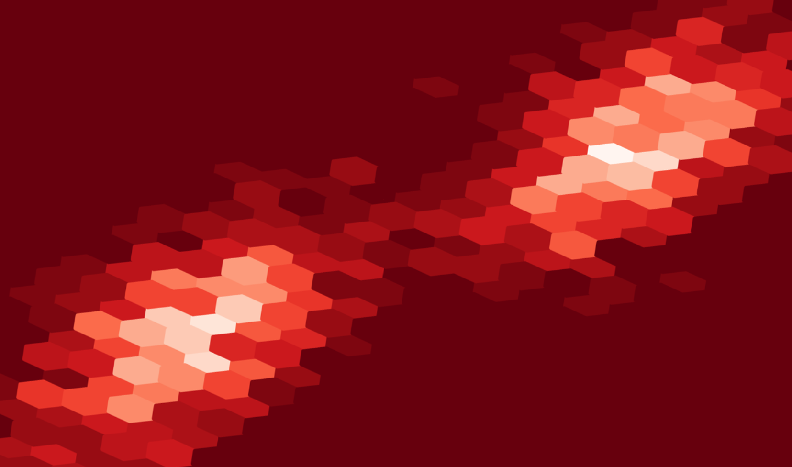

This blog post is meant for me to experiment with the Asciidoc syntax to move away from Markdown and integrate it to this jekyll template, as
well as to document how I produced my background image.

## Preparing the environment

```python
# Import relevant libraries
import numpy as np
import matplotlib.pyplot as plt

# Define the figsize for all pyplot plots
plt.rcParams['figure.figsize'] = 10, 15
```

## Define useful parameters


```python
size = 500
loc = 5
scale = 1.8
x_factor = 0.5
```

## Generate the values to be ploted

Here we use gaussian distributions for generatin the image but you could use any to generate an image that suits you better.

```python
# Create 2 gaussian blobs distributed around 0 and concatenate them in a single vector
x = np.random.normal(size=size, loc=loc, scale=scale)
x = np.concatenate([x, -x])

# Create another vector as a combination of the previous one and a new gausian blob
y = (x * x_factor + np.random.normal(size=size*2))
```

## Create and save the plot

Here the colormap used is 'Reds_r' and for the real background image it was 'Blues_r'. 
To find a list of all available colors you can follow this [link][1].

```python
plt.hexbin(x, y, gridsize=(20,20), cmap=plt.get_cmap('Reds_r'))
plt.savefig('background_red.png', dpi=500)
```


{:target="_blank"}


Once this image is generated, you can use your favorite image editor to rotate it, crop it, etc... Be creative :)

[1]: https://matplotlib.org/tutorials/colors/colormaps.html
